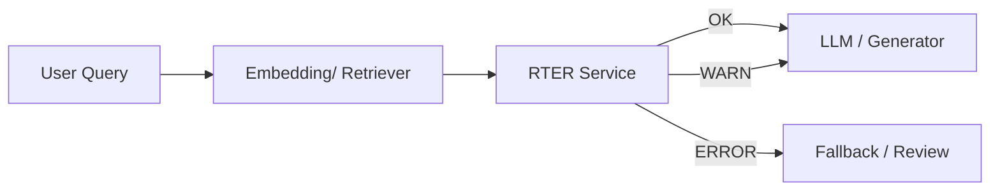

# RTER — Real-Time Embedding & Retrieval Error Scanner

RTER is a **production-grade ML microservice** that detects **silent failures** in
embedding-based retrieval systems (RAG, semantic search, recommendations) **before**
they reach users.

It acts as a **trust** & **decision gateway** for : 
- RAG pipelines
- Semantic Search
- rewrite/humanizer systems
- recommendation system

---
## RTER does not generate text , It evaluates whether your embeddings, retrieval, or rewrite is trustworthy.

## 🤔 Why RTER Exists (The Real Problem)

Modern AI systems rely on embeddings and vector search, but they fail **silently**:

- Similarity scores look high but **intent is wrong**
- Top-k results are **redundant**
- Retrieval quality **degrades over time**
- Rewrite subtly change meaning
- LLMs answer confidently with **wrong context**
- No alerts, no explanations, no safety net

> RTER exists to answer one question:
> **“Is my retrieval actually trustworthy right now?”**

---

## 👤 Who Should Use RTER

RTER is **NOT** for end users.

It is for:
- ML / Applied ML Engineers
- MLOps & Platform Engineers
- AI startups running RAG systems
- Teams using semantic search or recommendations
- Teams building Humanizers / Rewriters
- Any system using embeddings + LLMs 

If your system does **embedding → retrieve/rewrite → generate**,  
you should use RTER.

---

## 🧠 When You Should Use RTER

Use RTER **before** LLM generation or final output.

### Typical placement:
- After vector DB retrieval
- Before LLM / answer generation
- Afrer rewrite / paraphrase
- Before showing results to users

---

## 🔄 High-Level Architecture



🔬 What RTER Analyzes Internally
RTER does system-level ML analysis, not text generation.

It evaluates:

Signal	                      What it Detects
Similarity Distribution	-         Collapse or noisy retrieval
Redundancy Score        -         	Duplicate / repeated documents
Semantic Mismatch	    -         High similarity but wrong intent
Drift Detection	        -         Degradation over time
Decision Engine         - 	Converts signals → action
Severity & SLO	        - 	Ops-ready output
Metrics                 - 		Prometheus-compatible

👨‍💻 How Users Actually Interact With RTER
End users never call RTER directly.

RTER is used by your application.

Interaction model:
Your app sends embeddings or text to RTER, and RTER tells your app whether to proceed, warn, or block.

🧩 Core APIs
1️⃣ /scan — Retrieval Validation
Used for RAG / semantic search.
Input : 
```json
{
  "query": "what do cows eat",
  "retrieved_texts": [
    "Cows are herbivores and graze on grass.",
    "A dairy cow eats hay and silage."
  ]
}```
2️⃣ /scan/pair — Rewrite / Humanizer Safety
Used for humanizers, paraphrasers, summarizers.

Input
```json
{
  "original": "The company allows refunds within seven days.",
  "rewritten": "Customers can request their money back within a week."
}```
➡️ Ensures meaning is preserved, not hallucinated.

3️⃣ /scan/batch — Scale
Used when validating multiple retrievals at once.

🚦 Decision Semantics
Status               	Meaning
ok	                 Safe to proceed
warn	             Proceed with caution / log
error	             Block, fallback, or regenerate

📈 Metrics & Observability
RTER exposes:

1- request counts
2- drift detections
3- latency histograms
All metrics are Prometheus-compatible via:
```bash
/metrics
```
```Note
- RTER does not store embeddings
- RTER does not maintain memory
- RTER does not enforce policies
- RTER is a real-time trust gate, not a memory system.
- Think of RTER as middleware for semantic correctness.

```

🚀 RTER adds a missing safety layer to embedding-based AI systems.

It answers:

“Should my system trust this retrieval or rewrite right now?”

Before users ever see the output.

## License

This project is licensed under the Apache License 2.0.  
See the [LICENSE](License) file for details.
